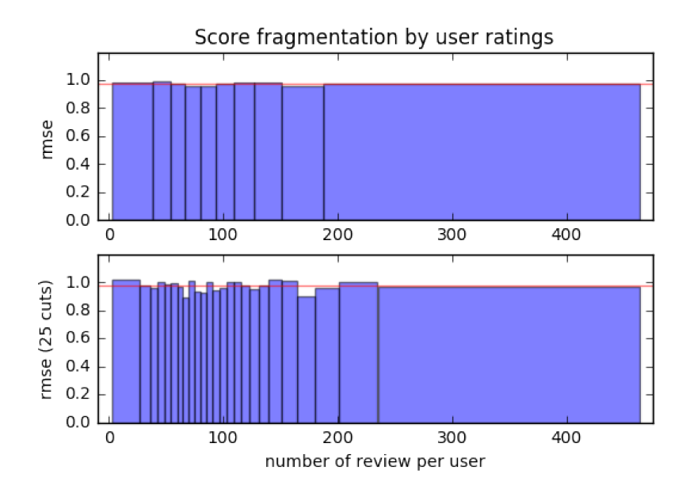
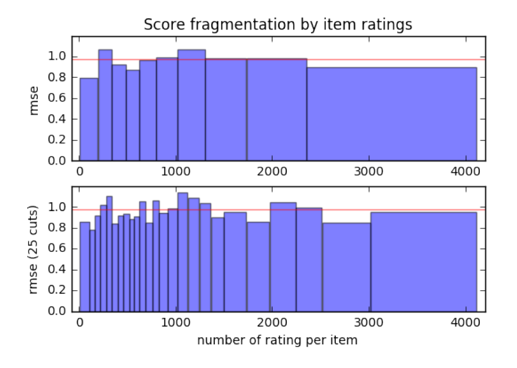

# ALS and deep learning for recommender system

This project is an attempt to use deep learning instead of classic ALS for recommender system. It uses various embedding to achieve an average RMSE of 0.97445 against ALS baseline of 0,98201.

## Data

The dataset (unzip `data.zip`) represents a 100'000 by 10'000 matrix (10M entries) filled with roughly 1M values (sparse). It contains user ratings for items with no additional data.

## Getting started

Libraries used:

 * Scipy
 * Numpy
 * Keras v1.1.1
 * Tensorflow v0.11.0
 * h5py
 * Sklearn
 * mca
 * tqdm

Execute the following command to install the libraries:

```shell
pip3 install scipy keras==1.1.1 sklearn numpy h5py tqdm git+https://github.com/esafak/mca
```

In order to install Tensorflow, follow the guide on this link: https://www.tensorflow.org/get_started/os_setup

In the "export" command, replace the version number from "12" to "11".

### `run.py`

This script implements the neural network producing our best predictions. It loads a previously created and trained network in order to reproduce our best submission.

Note: The ratings might differ from our Kaggle submission starting at the 7th or 8th decimal digit due to floating-point differences (GPU vs CPU/system).

### `run_als.py`

This script implements Alternating Least Squares.

### `train.ipynb`

This Jupyter notebook creates the neural network and trains it.

### `setup.ipynb`

This Jupyter notebook splits and forges the data to be used by the neural network.

### Fragmentation evalution

To check that no user and no item behaves in an unexpected way (for the net), one can sort the user by the number of ratings they did and the item by the number of times they are rated. This allows to split into even cuts and compute the score on those small subsets. Following figures show specific subsets and fragmentations giving an insight on their impact over the score. Surprisingly the less rated items did not penalize the score while mid rated items have a worse impact. On the user side, there are some variance but it remains negligeable.



The number of ratings given by one user does not have a lot of impact on the global score (red line).



The number of items rated varies more. The mid rated items penalize the most the whole score.

